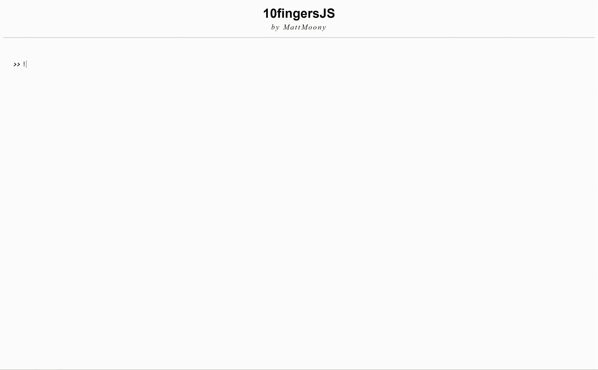

    

# 10fingersJS
_A pure JavaScript-Typewriter._

---

Provide strings and see them magically being typed out on the page. The typer will automatically detect which part of the string should be removed, in order for the new one to correctly appear, so only the necessary parts will be deleted.

## Installation

#### Script tag

```html
<script src='https://cdn.jsdelivr.net/gh/MattMoony/10fingersJS@v1.2/src/tenfingers.js'></script>
```

## Setup

```javascript
let target = document.getElementById('target');
let typer = new TenFingers(target);
```

## Usage

#### Basic Example

In this example we will use TenFingers to type a couple of strings into the [previously](#Setup) specified element.

```javascript
// ...

typer.typeAll([
  '!&copy; MattMoony',
  'Hello World!',
  'Hello Whales!',
  'Hello Wales!',
  'Hello Water!',
  'Hello Mum!',
  '&num;great',
  'This is a statement',
  'This is a statement.',
]);

// ...
```



#### Or

You can achieve the same, by using a more complex, but easily customizable syntax.

```javascript
// ...

typer.clear()
      .type('!&copy; MattMoony')
      .pause(1250)
      .clear()
      .type('Hello World!')
      .pause(1250)
      .delete('orld!'.length)
      .type('hales!')
      .pause(1250)
      .delete('hales!'.length)
      .type('ales!')
      .pause(1250)
      // and so on ...

// ...
```

#### With options

Now, we will create a customized typer using the _args_ parameter.

```javascript
// ...

let args = {
  typingSpeed: 250,
  deletingSpeed: 125,
  cursorSpeed: .25,
  pauseTimeout: 1000,
  // pauseTimeoutS: 1,
  endTimeout: 3000,
  endStringTimeout: 1000,
  loop: true,
};
let typer = new TenFingers(target, args);

typer.typeAll([
  'Hello World!',
  'How are you doing?',
  'How are the people around you doing?',
  'Great, it was nice talking to you!',
]);

// ...
```

#### HTML strings

You can also pass IDs to the typer, it will then use the content of those elements.

```javascript
// ...

typer.typeAll([
  '#some_id',
  '#some_other_id',
]);

// ...
```

## Conclusion

That is about it. If you have any further questions or suggestions, feel free to contact me on [twitter](https://twitter.com/Matthia23184857).

---

_... Matthias M. (March, 2019)_
